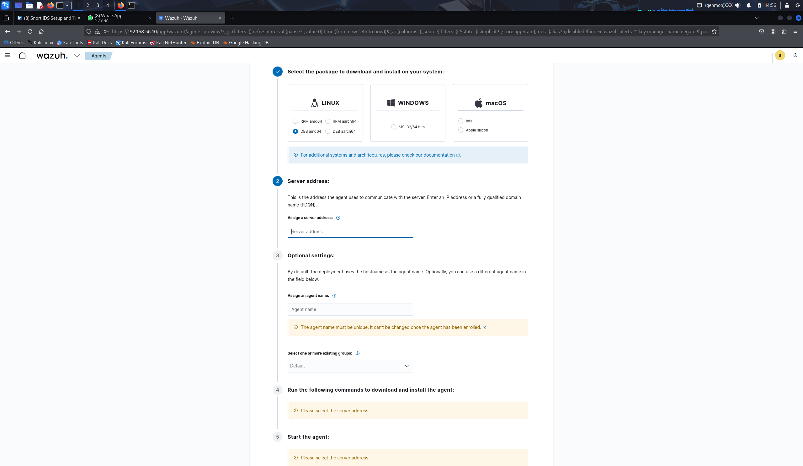

# Keamanan-Jaringan

# Wazuh Manager Instlasi
sudo apt-get update
sudo apt-get install curl apt-transport-https lsb-release gnupg -y
sudo bash ./wazuh-install.sh -a

# Script Cowrie

# Setup Wazuh Agent

